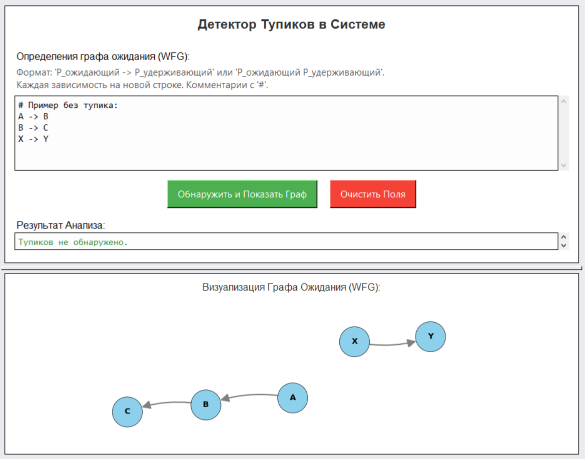
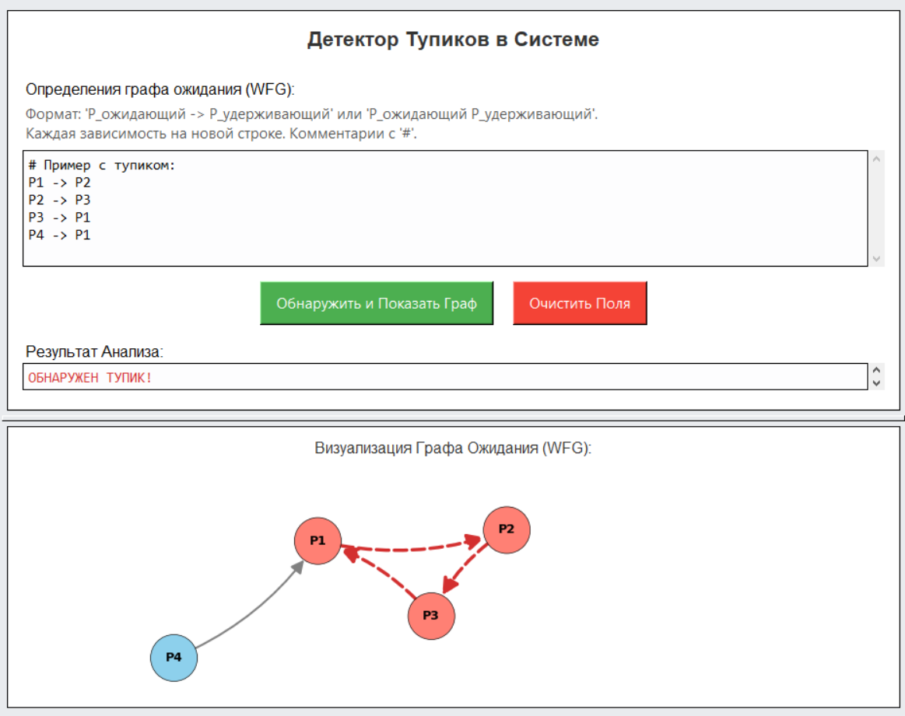

# WFG-Deadlock-Visualizer: Детектор Тупиков с Визуализацией


Инструмент с графическим интерфейсом для обнаружения тупиков (взаимоблокировок) в системе путем анализа и визуализации графа ожиданий (Wait-For Graph). Приложение создано в образовательных целях для демонстрации принципов работы алгоритмов обнаружения тупиков.

---

### 🖼️ Скриншоты

**(Примечание: Замените эти описания реальными скриншотами вашего приложения!)**

| Работа без тупиков | Обнаружение тупика |
| ------------------ | ------------------ |
|  |  |

### ✨ Основные возможности

*   **Обнаружение тупиков:** Реализован алгоритм поиска циклов в ориентированном графе для выявления взаимоблокировок.
*   **Интерактивная визуализация графа:** Отображение графа ожиданий с помощью `Matplotlib` и `NetworkX`.
    *   **Масштабирование:** Приближение и отдаление графа с помощью колеса мыши.
    *   **Панорамирование:** Перемещение видимой области графа зажатой левой кнопкой мыши.
    *   **Перетаскивание узлов:** Изменение положения узлов для улучшения читаемости (зажатой правой кнопкой мыши).
*   **Наглядное представление результата:**
    *   Циклы (тупики) подсвечиваются красным цветом как в графе, так и в текстовом отчете.
    *   При отсутствии тупиков выводится соответствующее сообщение зеленым цветом.
*   **Удобный GUI:** Простой и понятный интерфейс, созданный с помощью `Tkinter`.
*   **Обработка ошибок:** Приложение обрабатывает некорректный формат ввода и сообщает пользователю об ошибке.
*   **Устойчивость к отсутствию библиотек:** Основная логика обнаружения тупиков работает даже без установленных библиотек для визуализации.

---

### ⚙️ Технологический стек

*   **Python 3**
*   **Tkinter** для графического интерфейса пользователя (GUI)
*   **Matplotlib** для создания и отображения графиков
*   **NetworkX** для работы со структурой графа

---

### 🚀 Установка и запуск

1.  **Клонируйте репозиторий:**
    ```bash
    git clone https://github.com/skailHZ/WFG-Deadlock-Visualizer.git
    ```

2.  **Перейдите в папку проекта:**
    ```bash
    cd WFG-Deadlock-Visualizer
    ```

3.  **Установите зависимости:**
    ```bash
    pip install -r requirements.txt
    ```

4.  **Запустите приложение:**
    ```bash
    python DeadlockDetectorGUI.py
    ```

---

### 📖 Как использовать

1.  **Ввод данных:**
    *   В левом верхнем поле "Определения графа ожидания (WFG):" введите зависимости между процессами.
    *   Каждая зависимость должна быть на новой строке.
    *   Допустимые форматы: `P1 -> P2` (процесс P1 ждет ресурс, удерживаемый P2) или `P1 P2`.
    *   Строки, начинающиеся с `#`, считаются комментариями и игнорируются.

2.  **Анализ:**
    *   Нажмите кнопку **"Обнаружить и Показать Граф"**.

3.  **Результат:**
    *   В поле **"Результат Анализа:"** появится информация о наличии или отсутствии тупика.
    *   В нижней части окна будет построен **граф ожиданий**. Если тупик найден, образующие его узлы и ребра будут выделены красным цветом.

4.  **Очистка:**
    *   Нажмите кнопку **"Очистить Поля"**, чтобы сбросить поля ввода и вывода, а также очистить область визуализации.

### 📥 Скачать готовую версию

📎 [Скачать v1.0 (Windows .exe)](https://github.com/skailHZ/WFG-Deadlock-Visualizer/releases/download/v1.0/WFG-Deadlock-Visualizer_v1.0.zip) 

✔️ Для запуска не требуется установка Python  
📁 Архив содержит:
- `WFG-Deadlock-Visualizer.exe`
- Папку `images`
- Лицензию MIT
- Краткое руководство

### 📄 Лицензия

Проект выложен в открытый доступ в портфолио-целях. 
Использование в образовательных целях приветствуется. 
Для коммерческого использования обратитесь к автору.
